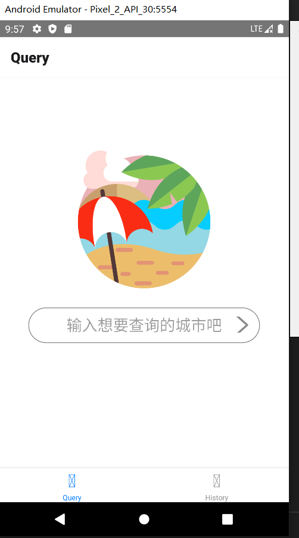
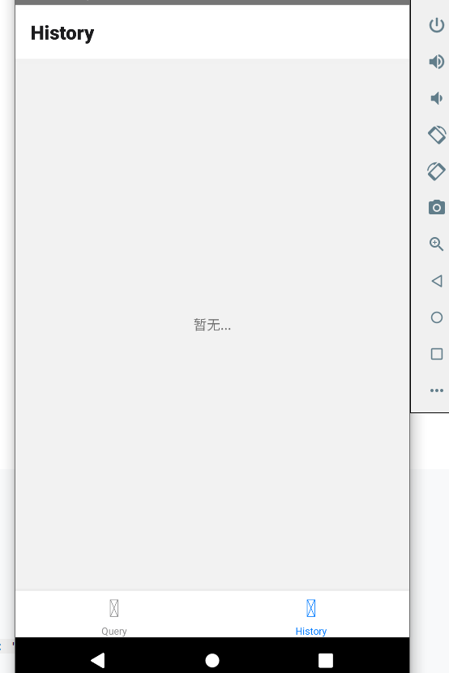
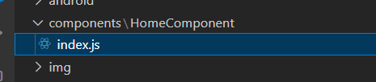
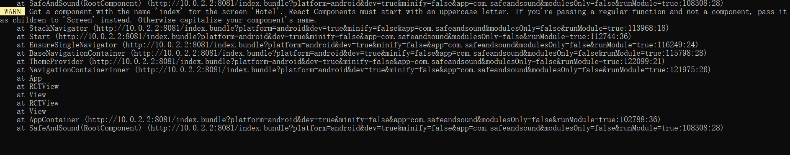
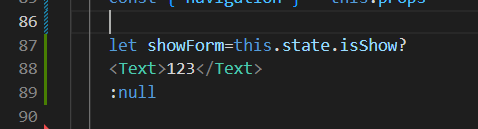
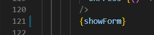
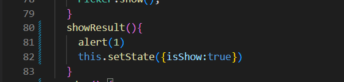

# 🧸 SafeAndSound

> a query a day keeps covid away
[react-native - 开发 React Native APP —— 从改造官方Demo开始（一）_个人文章 - SegmentFault 思否](https://segmentfault.com/a/1190000013428884#:~:text=App.js%20%E5%8F%AF%E4%BB%A5%E7%90%86%E8%A7%A3%E4%B8%BA%20react,native%EF%BC%88js%20%E9%83%A8%E5%88%86%EF%BC%89%20%E4%BB%A3%E7%A0%81%E9%83%A8%E5%88%86%E7%9A%84%E5%85%A5%E5%8F%A3%E6%96%87%E4%BB%B6%EF%BC%8C%E6%AF%94%E5%A6%82%E6%95%B4%E4%B8%AA%E9%A1%B9%E7%9B%AE%E7%9A%84%E8%B7%AF%E7%94%B1%E5%9C%A8%E8%BF%99%E9%87%8C%E5%AF%BC%E5%85%A5)

尝试但是没啥用，还是去官网好了


[Getting started | React Navigation](https://reactnavigation.org/docs/getting-started)


# navigation依赖安装

### 总结：遇到哪个库缺就装哪个库，有时候需要重新启动

* @react-navigation/native

```javascript
yarn add @react-navigation/native
```

* react-native-screens react-native-safe-area-context

```javascript
yarn add react-native-screens react-native-safe-area-context
```

* @react-navigation/native-stack

```javascript
yarn add @react-navigation/native-stack
```


yarn add @react-navigation/native

yarn add  react-native-safe-area-context


有时候安装后得重启，退出，在命令行yarn android


# tab的navigation尝试

以后说不定可以尝试底下来个tab

```typescript
import * as React from 'react'
import { Text, View } from 'react-native'
import { NavigationContainer } from '@react-navigation/native'
import { createBottomTabNavigator } from '@react-navigation/bottom-tabs'
import HomeComponent from './components/HomeComponent'

function HomeScreen () {
  return (
    <View style={{ backgroundColor: '#ffff', flex: 1, justifyContent: 'center', alignItems: 'center' }}>
      <HomeComponent />
    </View>
  )
}

function SettingsScreen () {
  return (
    <View style={{ flex: 1, justifyContent: 'center', alignItems: 'center' }}>
      <Text>暂无...</Text>
    </View>
  )
}

const Tab = createBottomTabNavigator()

export default function App () {
  return (
    <NavigationContainer>
      <Tab.Navigator>
        <Tab.Screen name="Query" component={HomeScreen} options={{
          headerTitleStyle: {
            fontWeight: 'bold',
          },
        }} />
        <Tab.Screen name="History" component={SettingsScreen} options={{
          headerTitleStyle: {
            fontWeight: 'bold',
          },
        }} />
      </Tab.Navigator>
    </NavigationContainer>
  )
}

```


​

```typescript

import * as React from 'react'
import { Text, View, TextInput, Image } from 'react-native'

export default HomeComponent = () => {
  const [value, onChangeText] = React.useState('')

  return (
    <>
      <Image
        style={{ height: 250, width: 250 }}
        source={require('../../img/沙滩.png')}
      />
      <View style={{
        backgroundColor: 'white',
        width: '80%',
        borderRadius: 20,
        marginBottom: 100
      }} >
        <TextInput
          style={{
            borderColor: 'gray',
            borderWidth: 1,
            height: 50,
            fontSize: 22,
            textAlign: 'center',
            borderRadius: 50,
          }}
          placeholder='输入想要查询的城市吧'
          onChangeText={text => onChangeText(text)}
          value={value}
        />
        <Image
          style={{ height: 23, width: 23, position: 'absolute', marginLeft: '85%', marginTop: 13 }}
          source={require('../../img/arrow-right.png')}
        />
      </View>
    </>
  )
}
```

# 暂时不管底部tab，我先完成对应的工作

### 刚开始切换到原来分支就出现错误，yarn android失败，报错如下

```typescript
Failed to load configuration
```

解决方式：重新npm install

我猜测是node_modules出了问题


### 小插曲：

一直都有warn，只需要把page下名字改了就行

​


### 防疫政策查询的实现过程

#### 下拉框尝试flatlist（废弃

[React Native - 下拉选择框 - 简书 (jianshu.com)](https://www.jianshu.com/p/9dde1acfa2b7)


https://github.com/beefe/react-native-picker


[React Native 实现城市选择组件 - 浅笑· - 博客园 (cnblogs.com)](https://www.cnblogs.com/qianxiaox/p/14102550.html)


可以用flatList实现

[FlatList · React Native 中文网](https://www.reactnative.cn/docs/next/flatlist)

#### 下拉框用picker实现

##### 环境安装踩坑

​

[React Native 0.68 安装react-native-picker报错：找不到compile - 简书 (jianshu.com)](https://www.jianshu.com/p/e452f8961b1c)

错误原因：较新的版本是使用implementation

改完其实还得另外下载一个依赖

[react-native【RN】——Execution failed for task ‘:react-native-picker:compileDebugJavaWithJavac‘.-IT Blog (itcn.blog)](https://itcn.blog/p/0529247398.html)

```typescript
npm i jetifier
或yarn add jetifier
```

##### 实现

#### 实现隐藏和重现（最后返回查询结果

​

#### rn的函数实现

[react native自定义class组件以及组件绑定事件处理 - 掘金 (juejin.cn)](https://juejin.cn/post/6844903876408115213)


#### 扫码检测的实现
最后还是没能成功合并到主分支并且实习该功能，在不同版本的依赖下可以成功实现，但项目已进行到尾期，为了避免大的错误故暂时放弃该功能