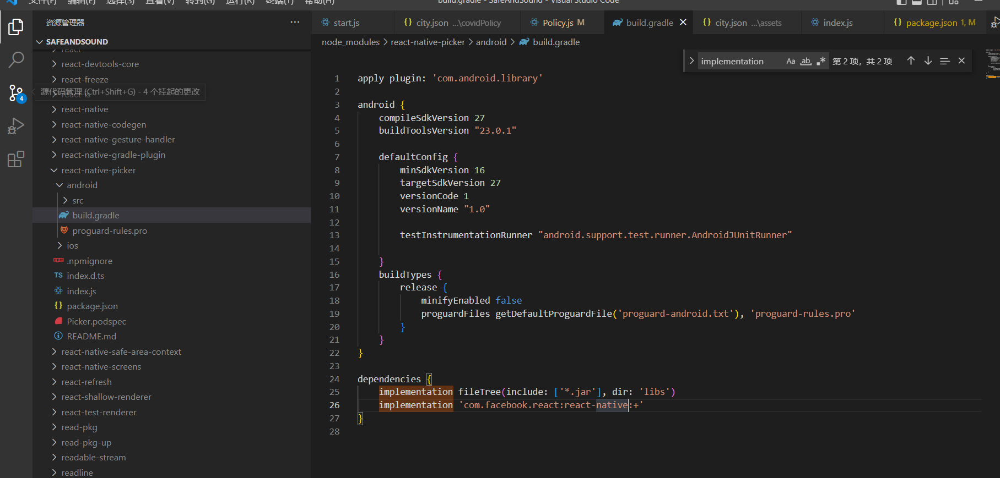

# 🧸 SafeAndSound
## 图标字体：
  通过 react-native-vector-icons/Ionicons 实现的。
  网址：https://github.com/oblador/react-native-vector-icons

> a query a day keeps covid away

# 运行项目
### 安装依赖
```
npm install
```
### 运行
```
yarn android
```
# 通常存在的报错
### 切换分支时不能运行

```typescript
Failed to load configuration
```

解决方式：重新npm install

我猜测是node_modules出了问题


### 下拉框用picker实现，这是一个稍微旧一点的版本
​
#### 两个措施
###### 修改implementation
[React Native 0.68 安装react-native-picker报错：找不到compile - 简书 (jianshu.com)](https://www.jianshu.com/p/e452f8961b1c)

错误原因：较新的版本是使用implementation
###### jetify
改完其实还得另外下载一个依赖

[react-native【RN】——Execution failed for task ‘:react-native-picker:compileDebugJavaWithJavac‘.-IT Blog (itcn.blog)](https://itcn.blog/p/0529247398.html)


```typescript
npm i jetifier或yarn add jetifier
npx jetify
```
# 一些值得学习的参考资料
## 依赖库
### 地图
[RNE-pro](https://supervons.github.io/react-native-echarts-pro-docs/zh-cn/docs/intro/)

## 参考文档
[地图组件学习](https://juejin.cn/post/6992857405042212872)
